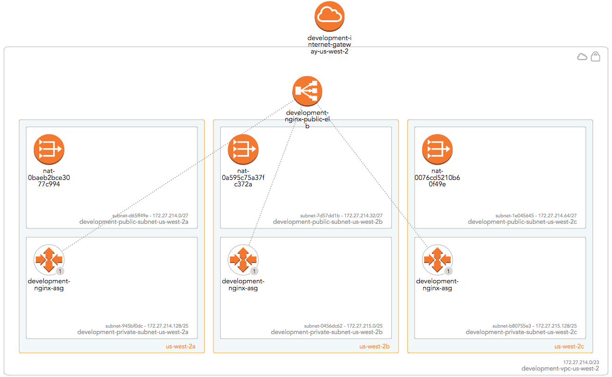
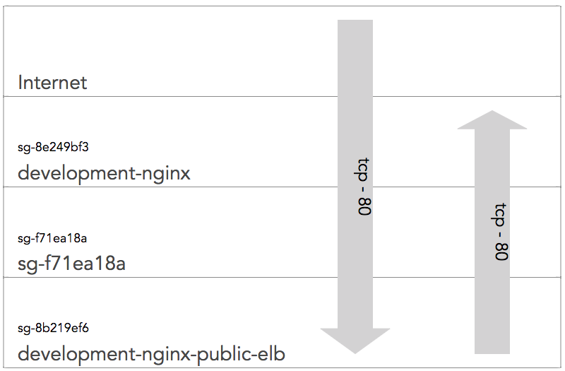

# Multi Availability Zone AWS Terraform

The architecture described by this codebase can be seen visually below. It
provides a straightforward way to provision an environment segregated at 
the VPC level, with a highly available load balancer fronting Nginx servers 
distributed across three availability zones within the AWS 'us-west-2' region.

<p align="center">
  
</p>

<p align="center">
  
</p>

## Prerequisites

You will need to:
* Install [Terraform 0.10.6+](https://www.terraform.io) 
* Install [Python 3](https://www.python.org/downloads/) (not necessary if you do not want to use the wrapper script)
* Setup an [AWS account](https://aws.amazon.com/account/) and a power user account!

Optional (but recommended):
* If you are not wed to Vim/Nano/Emacs :wink: then I would highly recommend using [IntelliJ Community Edition](https://www.jetbrains.com/idea/download).
It is an excellent IDE with plugin support for [HashiCorp Configuration Language (HCL),](https://github.com/hashicorp/hcl) 
Terraform's configuration syntax of choice.

Recommended reading for those new to Terraform:
* [Introduction to Terraform](https://www.terraform.io/intro/index.html)

Optional reading for all:
* [Terraform up and Running](https://www.terraformupandrunning.com/) - This is available on Safari Books for those with a subscription

## Project Strcture

TODO

## Running the Project

### Assumptions

1.  You have defined valid AWS credentials in `~/.aws/credentials` under the default profile. e.g:
    ```
    [default]
    region = us-west-2
    aws_session_token = [TOTALLY_SESSION_TOKEN]
    aws_security_token = [TOTALLY_SECURITY_TOKEN]
    aws_secret_access_key = [TOTALLY_REAL_SECRET_ACCESS_KEY_ID]
    output = json
    aws_access_key_id = [TOTALLY_REAL_ACCESS_KEY_ID]
    ```
    Do not be alarmed if you dont have all the lines listed above. It will vary between federated and non-federated accounts.

2.  You have updated the constant `STATE_BUCKET_NAME` in the [python build script](oms-terraform-wrapper.py). This is due
    to S3 Bucket names needing to be globally unique. Each environment creates its own bucket for storing Terraform state.
    The environment name is prefixed to the `STATE_BUCKET_NAME` (e.g. `production-oms-terraform-state-bucket`).


### Creating an Environment

1. `cd [ROOT_OF_TERRAFORM_PROJECT]`
2. `./oms-terraform-wrapper.py plan development network`. 
    ```
    Plan: 48 to add, 0 to change, 0 to destroy.
    
    ------------------------------------------------------------------------
    
    This plan was saved to: development-network.tfstate
    
    To perform exactly these actions, run the following command to apply:
        terraform apply "development-network.tfstate"
    ```
3. Once you have reviewed the plan and are happy, simply run `./oms-terraform-wrapper.py apply development network`
    ```
    Apply complete! Resources: 48 added, 0 changed, 0 destroyed.
    ```

4. To confirm the successful deploy you can find the public ELB's URL and navigate to it.
You will be greeted by the Nginx welcome page. You will have to be patient (<5mins) 
for the page to appear, this is due to how the Health Checks are configured. They 
currently set to check the instance exists, not that Nginx is responding on port 80.


## Destroying an Environment
1. `cd [ROOT_OF_TERRAFORM_PROJECT]`
2. `./oms-terraform-wrapper.py destroy development network`. You'll be presented with a list of all resources to be destroyed.
    ```
    Plan: 0 to add, 0 to change, 48 to destroy.
    
    Do you really want to destroy?
      Terraform will destroy all your managed infrastructure, as shown above.
      There is no undo. Only 'yes' will be accepted to confirm.
    
      Enter a value:
    ```
3. Enter `yes` and wait for all your hard work to be destroyed.
    ```
    Destroy complete! Resources: 48 destroyed.
    ```

## Is this production ready? If not, what needs to be done?
This is not in a state for production use. The following is still todo:
* Write tests for python wrapper file
* Refactor creation of ASG out of `modules/network` and into `modules/application`
* Set S3 state buckets to be encrypted by default. State can and will hold sensitive data!
* Remove configuration work from terraform such as `lib/nginx.sh`. I strongly believe this is the responsibility of a 
configuration tool such as Ansible.
* Update ELB Health checks to check against Nginx endpoint
* Update Terraform to ensure Launch configs & ASGs are created in the right order to 
facilitate zero-downtime deployments.
* DNS entries for ELB endpoint

## License

TODO

## Acknowledgments

Utilising:
* [Terraform](https://www.terraform.io)
* [AWS boto3](https://boto3.readthedocs.io/en/latest/)
* [Python 3](https://www.python.org)
